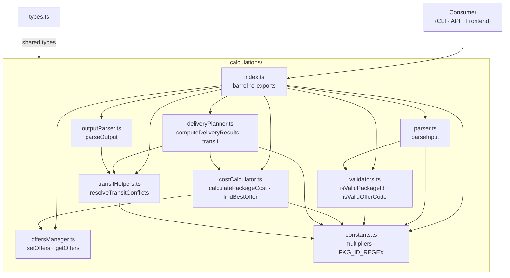

# @nurulizyansyaza/courier-service-core

Zero-dependency TypeScript library for the **Courier Service** App Calculator. Handles cost calculation, offer discounts, shipment planning and delivery time estimation.

## Setup

### Prerequisites

- **Node.js** 18 or 20 — check with `node --version`
- **npm** — check with `npm --version`

### Step 1 — Install dependencies

```bash
cd courier-service-core
npm install
```

### Step 2 — Build the library

```bash
npm run build
```

This creates a `dist/` folder with the compiled JavaScript. Other repos (API, CLI, Frontend) depend on this — always build core first.

### Step 3 — Run the tests

```bash
npm test
```

You should see all **147 tests** pass across **8 test suites**.

## Installation (as a package)

If you want to use the core library as an npm package in another project:

```bash
npm install @nurulizyansyaza/courier-service-core
```

## API

### Types

| Type | Description |
|------|-------------|
| `Package` | `{ id, weight, distance, offerCode? }` |
| `Offer` | Offer definition with code, discount %, weight/distance ranges |
| `Fleet` | `{ count, maxSpeed, maxWeight }` |
| `DeliveryResult` | Simple result: `{ id, discount, cost, time }` |
| `DetailedDeliveryResult` | Extended result with vehicle/round/return-time metadata |
| `ParsedResult` | Result parsed from CLI-style text output |
| `CalcOfferCriteria` | Offer matching criteria |
| `TransitPackageInput` | In-transit package descriptor |
| `TransitAwareResult` | Delivery result that accounts for in-transit packages. Includes `output` (formatted text) and `results: DetailedDeliveryResult[]` (full detailed results with vehicleId, deliveryRound, packagesRemaining, currentTime, vehicleReturnTime, roundTripTime) |

### Offers

- **`setOffers(offers)`** — Replace the global offer table.
- **`getOffers()`** — Get a copy of the current offer table.
- **`getOffersRef()`** — Get a direct reference to the offer table (for read-only use).

Built-in offers: `OFR001` (10%), `OFR002` (7%), `OFR003` (5%).

### Parsing & Validation

- **`parseInput(input, mode)`** — Parse multiline CLI-format text into `{ baseCost, packages, vehicles? }`. `mode` is `'cost'` or `'time'`. Internally delegates to focused validators: `validateHeader()`, `validateVehicleLine()`, `validatePackageLine()`, `validateCrossPackage()`.
- **`isValidPackageId(value)`** — Check if a string matches the `PKG\d+` pattern.
- **`isValidOfferCode(value)`** — Check if a string is a known offer code or `'NA'`.
- **`normalizeOfferCode(code)`** — Upper-case an offer code.

### Constants & Helpers

- **`WEIGHT_MULTIPLIER`** (`10`) — Weight multiplier in cost formula.
- **`DISTANCE_MULTIPLIER`** (`5`) — Distance multiplier in cost formula.
- **`MAX_PACKAGES_FOR_EXACT`** (`20`) — Threshold for switching from exact (O(2^n)) to greedy shipment algorithm.
- **`PKG_ID_REGEX`** — Shared regex for matching package IDs (`/^(?:pkg|PKG)\d+$/i`).
- **`extractPackageNumber(id)`** — Extract numeric suffix from a package ID (e.g., `"PKG3"` → `3`).

### Transit Conflict Resolution

- **`resolveTransitConflicts(packages, transitPackages, maxWeight)`** — Resolve ID conflicts between working packages and in-transit packages. Returns `{ workingPackages, clearedFromTransit, stillInTransit, renamedPackages }`.

#### Input Format Rules

**Line 1 (header)** — exactly 2 values, both numbers only:
```
base_cost no_of_packages
```
| Field | Rule |
|-------|------|
| `base_cost` | Positive number (no letters, no negatives) |
| `no_of_packages` | Whole number ≥ 1 (no decimals, no letters) |

**Lines 2–N (packages)** — exactly 4 values per line:
```
pkg_id weight distance offer_code
```
| Field | Rule | Valid | Invalid |
|-------|------|-------|---------|
| `pkg_id` | `PKG` + digits, case-insensitive, no spaces/hyphens | `PKG1`, `pkg2` | `PKG 1`, `PKG-1`, `-pkg1`, `p-1`, `ABC` |
| `weight` | Positive number only | `5`, `10.5` | `abc`, `5kg`, `-5` |
| `distance` | Positive number only | `100`, `30.5` | `abc`, `10km`, `-10` |
| `offer_code` | `OFR` + digits or `NA`, case-insensitive, no spaces/hyphens | `OFR001`, `ofr002`, `NA` | `OFR 001`, `OFR-001`, `ofr1-`, `o-1`, `BADCODE` |

Package IDs must be incremental starting from 1 (`PKG1`, `PKG2`, `PKG3`, …) and unique.

**Last line (vehicles, time mode only)** — exactly 3 positive numbers:
```
no_of_vehicles max_speed max_weight
```

**Vehicle line validation:**
- In time mode, if the vehicle line has the wrong number of values (e.g., 4 numbers instead of 3), the error now says `"Expected exactly 3 numbers ... but found N"` instead of a generic message.
- In cost mode, all-numbers lines (any count) on the last line are detected as likely vehicle info and produce a helpful suggestion to switch to time mode.

#### Multi-Error Collection

The parser collects **all** validation errors and reports them together in a single error message (newline-separated), so you can see everything that needs fixing at once:

```
Line 1: Base cost "abc" must be a number
Line 1: Package count "xyz" must be a whole number
Line 2: Invalid package ID "BAD": Must be "PKG" followed by digits (e.g., PKG1, pkg2)
Line 2: Invalid weight "-5": Must be a number
Line 3: Invalid distance "10km": Must be a number
Line 3: Invalid offer code "WRONG": Must be one of: OFR001/OFR002/OFR003, NA (case-insensitive)
```

Extra spaces **between** fields are handled gracefully (`PKG1   5   5   OFR001` works). Spaces **within** identifiers are detected and reported (`PKG 1` → use `PKG1`, `OFR 001` → use `OFR001`).

All IDs and offer codes are normalized to uppercase on output.

### Cost Calculation

- **`calculatePackageCost(pkg, baseCost)`** — Returns `{ discount, totalCost, offerCode?, deliveryCost }` for a single package.
- **`calculateDeliveryCost(input)`** — End-to-end: parse input → compute costs → return formatted string.
- **`findBestOffer(weight, distance)`** — Find the highest-discount matching offer for given weight/distance.

### Delivery Time

- **`computeDeliveryResultsFromParsed(baseCost, packages, vehicles)`** — Core planner: returns `DetailedDeliveryResult[]` with delivery times, vehicle assignments, and round info.
- **`computeDeliveryResultsWithTransit(input, transitPackages)`** — Same as above but merges in-transit packages.
- **`calculateDeliveryTime(input)`** — End-to-end: parse input → plan → return formatted string.
- **`calculateDeliveryTimeWithTransit(input, transitPackages)`** — End-to-end with transit support, returns `TransitAwareResult` containing both formatted `output` text and a `results: DetailedDeliveryResult[]` array with full vehicle/round/time metadata.

### Output Parsing

- **`parseOutput(output, calculationType, input, transitPackages?)`** — Parse CLI-style output back into `ParsedResult[]`.
- **`getOfferCodeFromDiscount(deliveryCost, discount)`** — Reverse-lookup an offer code from a discount amount.

## Testing

```bash
npm test
```

You should see all **147 tests** pass across **8 test suites**.

## CI/CD

GitHub Actions workflow (`.github/workflows/ci.yml`) runs on push/PR to `main`:

1. **Test** — runs `npm test` on Node 18 + 20
2. **Trigger Staging Deploy** — on push to `main`, triggers a staging deploy on [`courier-service`](https://github.com/nurulizyansyaza/courier-service), which triggers the staging deployment pipeline

Requires a `DEPLOY_TRIGGER_TOKEN` secret (fine-grained PAT with Actions + Contents write access on the `courier-service` repo).

## Module Architecture



## Project Structure

```
src/
  types.ts                     # All TypeScript interfaces
  index.ts                     # Barrel re-exports
  calculations/
    index.ts                   # Barrel for calculation modules
    constants.ts               # WEIGHT_MULTIPLIER, DISTANCE_MULTIPLIER, PKG_ID_REGEX, extractPackageNumber
    costCalculator.ts          # calculatePackageCost, calculateDeliveryCost, findBestOffer
    deliveryPlanner.ts         # computeDeliveryResultsFromParsed, calculateDeliveryTime, transit support
    offersManager.ts           # setOffers, getOffers, getOffersRef + built-in offer table
    outputParser.ts            # parseOutput, getOfferCodeFromDiscount
    parser.ts                  # parseInput (delegates to validateHeader, validatePackageLine, etc.)
    transitHelpers.ts          # resolveTransitConflicts (shared by deliveryPlanner + outputParser)
    validators.ts              # isValidPackageId, isValidOfferCode, normalizeOfferCode
tests/
  constants.test.ts            # 12 tests — multipliers, regex, extractPackageNumber
  costCalculator.test.ts       # Cost calculation and offer matching
  deliveryPlanner.test.ts      # Delivery planning, vehicle assignment, transit
  offersManager.test.ts        # Offer table CRUD
  outputParser.test.ts         # Output parsing and offer code reverse-lookup
  parser.test.ts               # Input parsing, validation, multi-error collection
  transitHelpers.test.ts       # 10 tests — conflict resolution, renaming, case sensitivity
  validators.test.ts           # Package ID and offer code validation
```
