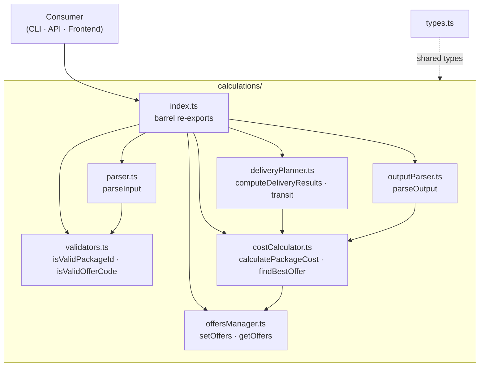

# @nurulizyansyaza/courier-service-core

Zero-dependency TypeScript library for the **Courier Service** App Calculator. Handles cost calculation, offer discounts, shipment planning, and delivery time estimation.

## Installation

```bash
npm install @nurulizyansyaza/courier-service-core
```

## API

### Types

| Type | Description |
|------|-------------|
| `Package` | `{ id, weight, distance, offerCode? }` |
| `Offer` | Offer definition with code, discount %, weight/distance ranges |
| `Fleet` | `{ count, maxSpeed, maxWeight }` |
| `DeliveryResult` | Simple result: `{ id, discount, cost, time }` |
| `DetailedDeliveryResult` | Extended result with vehicle/round/return-time metadata |
| `ParsedResult` | Result parsed from CLI-style text output |
| `CalcOfferCriteria` | Offer matching criteria |
| `TransitPackageInput` | In-transit package descriptor |
| `TransitAwareResult` | Delivery result that accounts for in-transit packages |

### Offers

- **`setOffers(offers)`** — Replace the global offer table.
- **`getOffers()`** — Get a copy of the current offer table.
- **`getOffersRef()`** — Get a direct reference to the offer table (for read-only use).

Built-in offers: `OFR001` (10%), `OFR002` (7%), `OFR003` (5%).

### Parsing & Validation

- **`parseInput(input, mode)`** — Parse multiline CLI-format text into `{ baseCost, packages, vehicles? }`. `mode` is `'cost'` or `'time'`.
- **`isValidPackageId(value)`** — Check if a string matches the `PKG\d+` pattern.
- **`isValidOfferCode(value)`** — Check if a string is a known offer code or `'NA'`.
- **`normalizeOfferCode(code)`** — Upper-case an offer code.

### Cost Calculation

- **`calculatePackageCost(pkg, baseCost)`** — Returns `{ discount, totalCost, offerCode?, deliveryCost }` for a single package.
- **`calculateDeliveryCost(input)`** — End-to-end: parse input → compute costs → return formatted string.
- **`findBestOffer(weight, distance)`** — Find the highest-discount matching offer for given weight/distance.

### Delivery Time

- **`computeDeliveryResultsFromParsed(baseCost, packages, vehicles)`** — Core planner: returns `DetailedDeliveryResult[]` with delivery times, vehicle assignments, and round info.
- **`computeDeliveryResultsWithTransit(input, transitPackages)`** — Same as above but merges in-transit packages.
- **`calculateDeliveryTime(input)`** — End-to-end: parse input → plan → return formatted string.
- **`calculateDeliveryTimeWithTransit(input, transitPackages)`** — End-to-end with transit support, returns `TransitAwareResult`.

### Output Parsing

- **`parseOutput(output, calculationType, input, transitPackages?)`** — Parse CLI-style output back into `ParsedResult[]`.
- **`getOfferCodeFromDiscount(deliveryCost, discount)`** — Reverse-lookup an offer code from a discount amount.

## Testing

```bash
npm test
```

## CI/CD

GitHub Actions workflow (`.github/workflows/ci.yml`) runs on push/PR to `main`:

1. **Test** — runs `npm test` on Node 18 + 20
2. **Trigger Staging Deploy** — on push to `main`, triggers a staging deploy on [`courier-service`](https://github.com/nurulizyansyaza/courier-service), which triggers the staging deployment pipeline

Requires a `DEPLOY_TRIGGER_TOKEN` secret (fine-grained PAT with Actions + Contents write access on the `courier-service` repo).

## Module Architecture



## Project Structure

```
src/
  types.ts                     # All TypeScript interfaces
  index.ts                     # Barrel re-exports
  calculations/
    index.ts                   # Barrel for calculation modules
    costCalculator.ts          # calculatePackageCost, calculateDeliveryCost, findBestOffer
    deliveryPlanner.ts         # computeDeliveryResultsFromParsed, calculateDeliveryTime, transit support
    offersManager.ts           # setOffers, getOffers, getOffersRef + built-in offer table
    outputParser.ts            # parseOutput, getOfferCodeFromDiscount
    parser.ts                  # parseInput
    validators.ts              # isValidPackageId, isValidOfferCode, normalizeOfferCode
```
